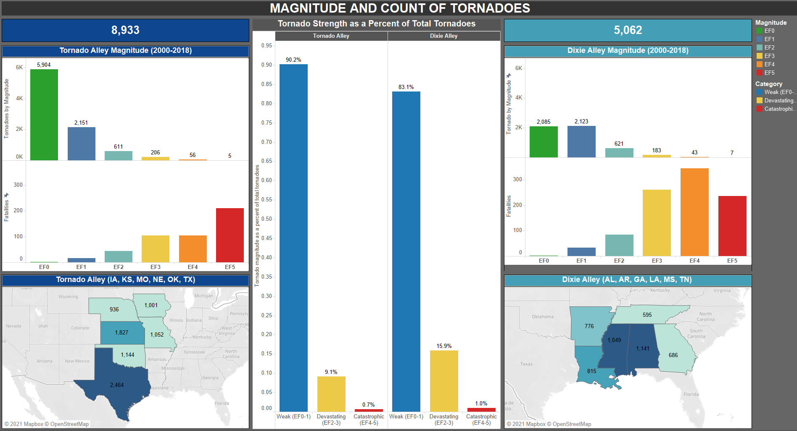

# Lethal Alleys
## Tornado Alley vs Dixie Alley, a comparison of tornadoes from 2000-2018

## TABLE OF CONTENTS
* [Introduction](#introduction)
* [The Data](#the-data)
* [Approach](#approach)
* [Tools Used](#tools-used)
* [Sources](#sources)
* [Tableau Story](#tableau-story)

## INTRODUCTION

The National Oceanic and Atmospheric Administration (NOAA) reports that the United States experiences an average of 1,000 tornadoes per year.  Most of these tornadoes are found in the Great Plains in an area, unofficially, known as Tornado Alley. The second most vulnerable area for multiple tornadoes to strike is in the southern United States in what is lesser known as Dixie Alley.  

This capstone project will use publicly available data from NOAA to analyze both Tornado Alley and Dixie Alley tornadoes in terms of frequency, magnitude, number of fatalites and the time of day to understand which “Alley” is more dangerous.

I selected this project because I find this topic and all naturally occurring disasters for that matter, fascinating. I’ve worked as a disaster management program manager and have witnessed the catastrophic impact such events have on people’s lives. This capstone project is an opportunity for me to provide compelling information, powered by data to save lives.

## THE DATA

Data from NOAA's Storm Prediction Center was used to look at the number, location and magnitude of tornadoes from 2000 - 2018.
To find the number of fatalities by year and location of occurrence, 18 .pdf files were pulled from the National Weather Service and converted, in python, to one .csv file.  
States were grouped by Tornado Alley (IA, KS, MO, NE, OK, TX) and Dixie Alley (AL, AR, GA, LA, MS, TN) and analyzed.

## APPROACH

### Issues and Challenges:

* Neither Tornado Alley nor Dixie Alley are officially designated names but rather a nickname bestowed on them as a reference to areas that have a higher number of tornadoes.

* Official boundaries are not defined for Tornado Alley and can include up to 13 or more states.

* Official Boundaries for Dixie Alley are also not defined but when referenced in literature, Dixie Alley consistently includes six (6) states  (AL, AR, GA, LA, MS, TN).

* For comparison, six (6) states  (IA, KS, MO, NE, OK, TX) from “Tornado Alley,” with a high frequency of tornadoes, was used in this analysis.

* To reduce some of the subjectivity involved with determining the more lethal alley, an evaluation criteria was used with weights given to each criteria on a scale of 1-5.

## TOOLS USED
* *Excel*
* *Python/Pandas/tabula-py* - for converting pdf to csv and data exploration
* *Tableau* - for creating dashboard/presentation
* *Studio Visual Code* - for editing html/markdown files
* *Git* - for version control

## SOURCES
* NOAA Storm Events Database https://www.ncdc.noaa.gov/stormevents/
* NWS Weather Related Fatality and Injury Statistics https://www.weather.gov/hazstat/
* US Census Bureau https://www.census.gov/construction/nrc/index.html
* US Census Bureau https://www.census.gov/data/tables/2010/dec/density-data-text.html
* US Census Bureau https://www.census.gov/data/tables/time-series/econ/mhs/shipments.html

## TABLEAU STORY

Please follow this link to see my analysis and conclusions in Tableau Story format.

TBD
